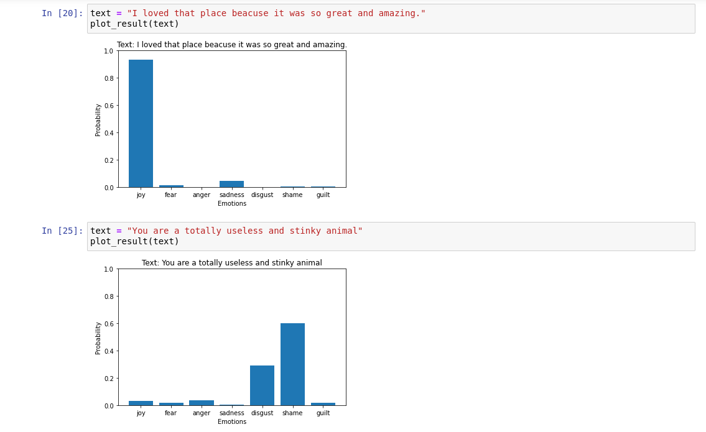

# Emotion detection in text 

In this project we try to figure out the emotion present in a given text through the application of Neural Network, using Python library Keras. 

We will use our model to label text using 7 different types of emotions: joy, fear, anger, sadness, disgust, shame and guilt.

The neural network used here contains two one-dimensional convnets along with their max-pooling layers stacked on top of one another. The final layer is a softmax activated dense neural network, that outputs the probability of the given text conveying each emotion.

**Finally the result is displayed in a bar diagram of probabilties as shown below:**

View the jupyter notebook **emotion_dection.ipynb** for more details.

### References Used:
1. https://thecleverprogrammer.com/2021/02/19/text-emotions-detection-with-machine-learning/
2. Deep Learning with Python, 1st Edition by François Chollet
